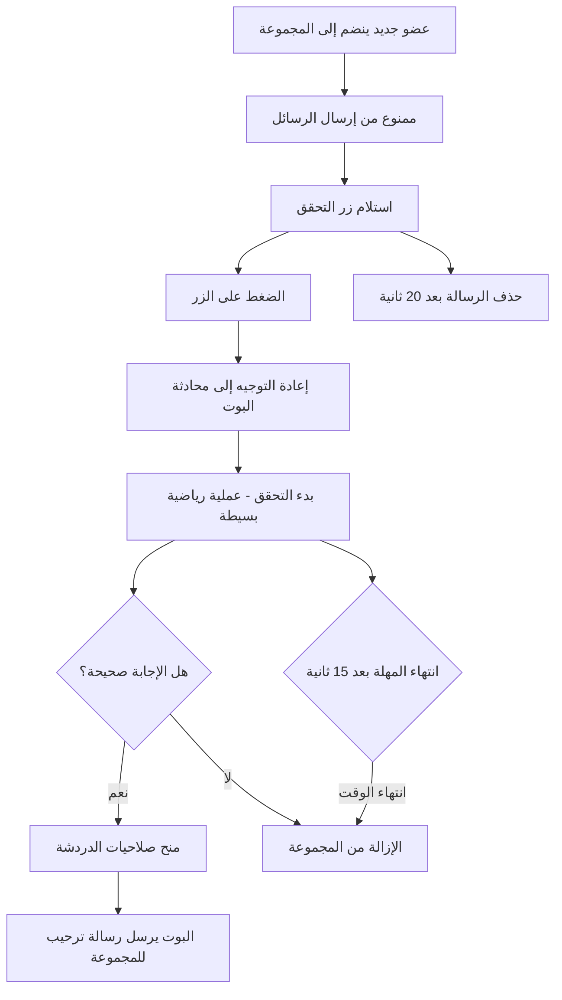

<div dir="rtl">

# سالم حارس البوابة - روبوت

هذا البوت، الذي تم تطويره باستخدام لغة Go، مصمم ليكون حارسًا للدردشة الجماعية على Telegram. يهدف إلى ضمان انضمام المستخدمين الموثوق بهم فقط، وذلك عبر مطالبتهم باختيار الإجابة الصحيحة أو حل مسألة رياضية ضمن مدة زمنية محددة.


## المميزات
* حل مسألة رياضية محددة بزمن معين لتصفية المستخدمين غير المرغوب فيهم أو المزعجين.
* يدعم اللغة العربية.
* يعتمد على المتغيرات البيئية لضبط الإعدادات.

## سير العمل

هذا هو مسار عملية التحقق


## البدء

المتطلبات الأساسية

* إصدار Go 1.20 أو أحدث.
* الحصول على الرمز السري للبوت من خلال [BotFather](https://telegram.me/BotFather)

## التثبيت

1. نسخ المستودع:

```console
git clone https://github.com/zakaria-chahboun/telegram_gatekeeper_bot.git
cd telegram_gatekeeper_bot
```

2. تثبيت الاعتماديات:

```console
go mod tidy
```

3. إعداد المتغيرات البيئية:

أنشئ ملفًا باسم `.env` في المجلد الجذري للمشروع وأضف المتغيرات البيئية الخاصة بك:

```env
BOT_TOKEN=your-telegram-bot-token
```

4. تشغيل البوت:

```console
go run main.go
```

### الاستخدام
بعد تشغيل البوت، سيقوم بمراقبة المستخدمين الجدد الذين ينضمون إلى مجموعتك تلقائيًا. عندما يحاول مستخدم جديد الانضمام، سيطلب منه البوت اجتياز عملية التحقق. إذا فشل في الإجابة بشكل صحيح خلال المهلة الزمنية، سيتم منعه من الانضمام.

### المساهمة
المساهمات مرحب بها! لا تتردد في فتح تقارير الأخطاء أو إرسال طلبات السحب PRs.

### الترخيص
هذا المشروع مرخص تحت رخصة MIT. للاطلاع على التفاصيل، راجع ملف الترخيص.
</div>