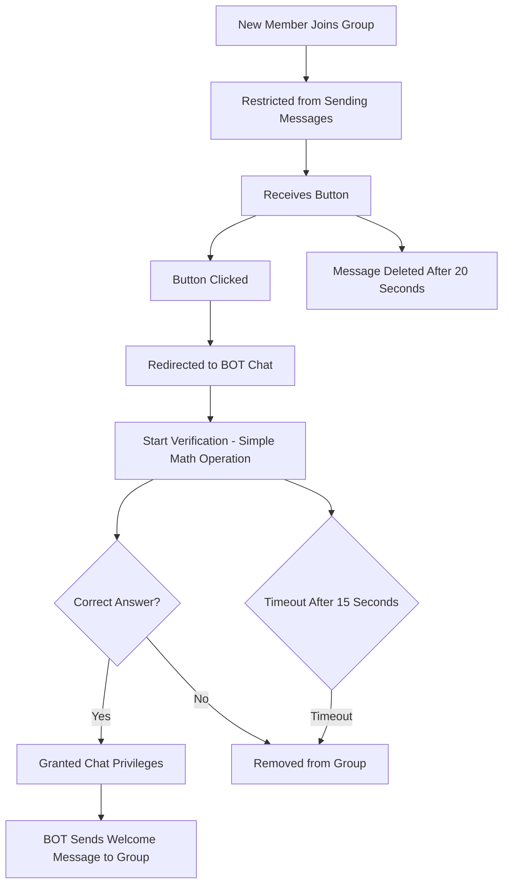

# Saalim Gatekeeper Bot

> [!NOTE]  
> If you're an Arabic speaker, please visit the [Arabic documentation](/README.Arabic.md).

This is a Telegram bot built using Go, designed to serve as a gatekeeper for group chats. The bot ensures that only valid users can join by requiring them to choose the correct option or solve a math problem within a limited time.


## Features
* Timed math problem to filter out unwanted or spam users.
* Supports Arabic language messages.
* Uses environment variables for configuration.

## Flow

This is the flow of verification


## Getting Started

Prerequisites

* Go 1.20 or later
* A Telegram bot token from [BotFather](https://telegram.me/BotFather)

## Installation

1. Clone the repository:

```console
git clone https://github.com/zakaria-chahboun/telegram_gatekeeper_bot.git
cd telegram_gatekeeper_bot
```

2. Install dependencies:

```console
go mod tidy
```

3. Set up environment variables:

Create a `.env` file in the root directory of the project and add your environment variables:

```env
BOT_TOKEN=your-telegram-bot-token
```

4. Run the bot:

```console
go run main.go
```

### Usage
Once the bot is running, it will automatically monitor new users joining your group. When a new user attempts to join, the bot will prompt them with a validation process. If they fail to answer correctly within the time limit, they will be prevented from joining.

### Contributing
Contributions are welcome! Feel free to open issues or submit pull requests.

### License
This project is licensed under the MIT License - see the LICENSE file for details.
